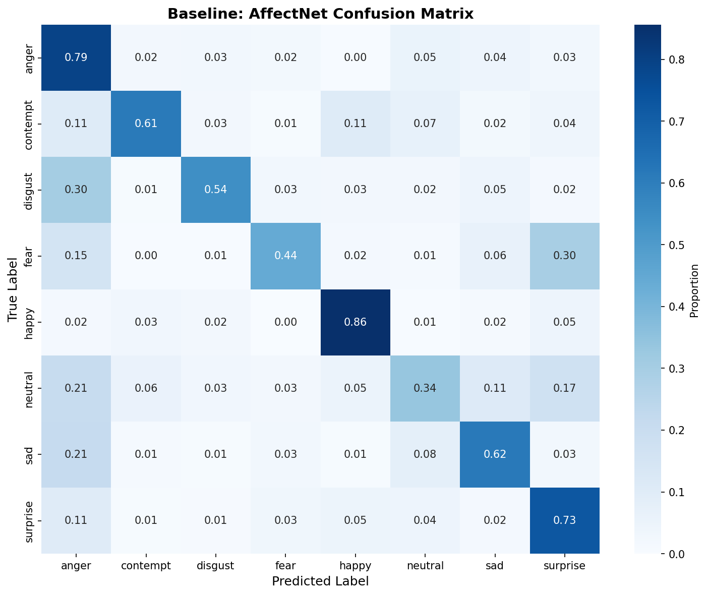
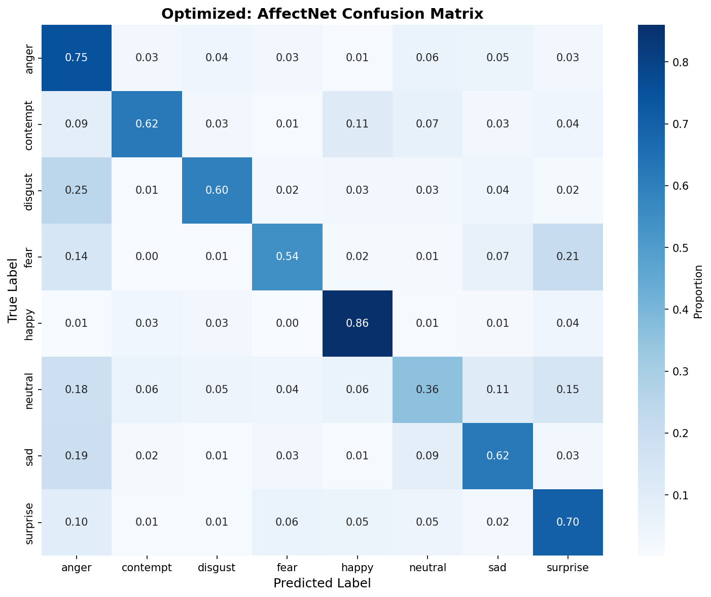
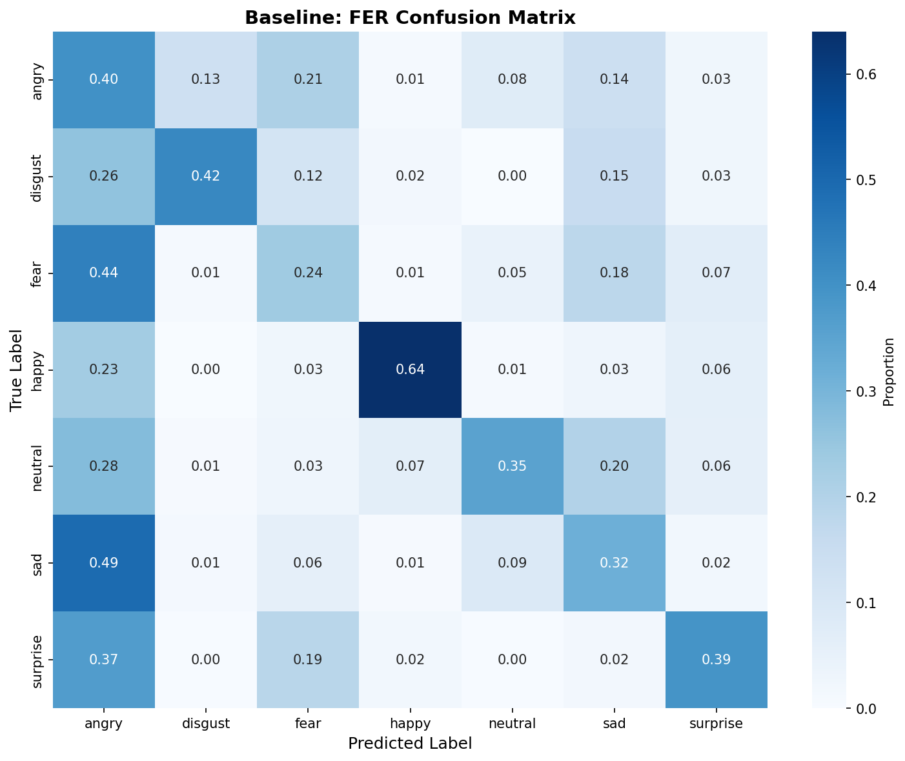
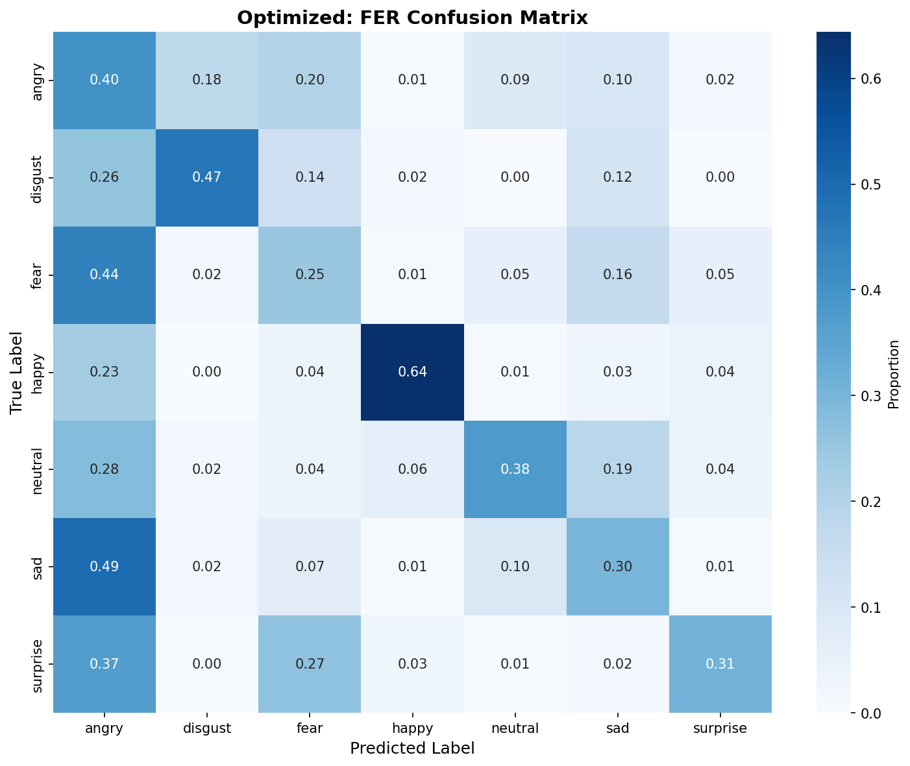

# Facial Expression Analyzer - Project Report

## Executive Summary

This project implements a real-time facial expression analysis system using a 3-model ensemble approach combined with dlib's 68-point facial landmark detection. The system is optimized through systematic hyperparameter tuning using Bayesian optimization.

---

## Implementation Journey

### Phase 1: Initial Approach with DeepFace

The project began using the DeepFace library, which provided an easy entry point for emotion recognition. However, results were disappointing:

- **Accuracy**: ~50%
- **Issues**: High confusion between similar emotions, inconsistent predictions
- **Conclusion**: DeepFace's single-model approach was insufficient for reliable emotion detection

---

## System Architecture

### Overview

The system combines three complementary emotion recognition models with 68-point facial landmark analysis:

```
Input Image
    │
    ▼
┌─────────────────────────┐
│  dlib HOG Face Detector │
└───────────┬─────────────┘
            │
            ▼
┌─────────────────────────┐
│  68-Point Landmarks     │
│  (shape_predictor)      │
└───────────┬─────────────┘
            │
    ┌───────┴───────┐
    │               │
    ▼               ▼
┌────────┐    ┌──────────────┐
│Landmark│    │ Face Crop    │
│Analysis│    │ (224x224)    │
└────┬───┘    └──────┬───────┘
     │               │
     │       ┌───────┼───────┐
     │       ▼       ▼       ▼
     │   ┌──────┐┌──────┐┌──────┐
     │   │enet  ││ vgaf ││ afew │
     │   │_b2   ││      ││      │
     │   └──┬───┘└──┬───┘└──┬───┘
     │      │       │       │
     │      └───────┼───────┘
     │              │
     │              ▼
     │    ┌─────────────────┐
     │    │ Weighted Voting │
     │    │ (per-emotion)   │
     │    └────────┬────────┘
     │             │
     └──────┬──────┘
            │
            ▼
    ┌───────────────┐
    │  Refinements  │
    │ (Geometric +  │
    │   Threshold)  │
    └───────┬───────┘
            │
            ▼
      Final Prediction
```

---
### Phase 2: Ensemble Approach with dlib

## Model Ensemble

### The Three Models

| Model | Architecture | Training Data | Strengths |
|-------|-------------|---------------|-----------|
| **enet_b2** | EfficientNet-B2 | AffectNet + FER | Happy, Neutral (clear, posed expressions) |
| **vgaf** | EfficientNet-B0 | VAFFace + Aff-Wild2 | Sad, Surprise (natural expressions) |
| **afew** | EfficientNet-B0 | Aff-Wild | Fear, Angry, Disgust (intense expressions) |

### Why These Models?

Different datasets capture different aspects of emotional expression:

- **AffectNet**: Large, diverse dataset but many posed expressions
- **FER2013**: Clean facial expressions but 7 classes only
- **VAFFace**: Natural, in-the-wild expressions
- **Aff-Wild**: Extreme poses and real-world conditions

By combining models trained on different distributions, we get more robust predictions across varied scenarios.

---

## Per-Emotion Weighted Voting

### The Concept

Rather than simple majority voting, each model contributes differently to each emotion prediction based on its demonstrated strengths:

```python
EMOTION_WEIGHTS = {
    'anger':    {'enet_b2': 0.3, 'vgaf': 0.2, 'afew': 0.5},
    'contempt': {'enet_b2': 0.4, 'vgaf': 0.3, 'afew': 0.3},
    'disgust':  {'enet_b2': 0.3, 'vgaf': 0.2, 'afew': 0.5},
    'fear':     {'enet_b2': 0.2, 'vgaf': 0.3, 'afew': 0.5},
    'happy':    {'enet_b2': 0.5, 'vgaf': 0.3, 'afew': 0.2},
    'neutral':  {'enet_b2': 0.5, 'vgaf': 0.3, 'afew': 0.2},
    'sad':      {'enet_b2': 0.3, 'vgaf': 0.5, 'afew': 0.2},
    'surprise': {'enet_b2': 0.3, 'vgaf': 0.5, 'afew': 0.2},
}
```

### How It Works

For each emotion, we calculate a weighted average of the three model predictions:

```
ensemble_score(emotion) =
    (enet_b2_score × weight_enet_b2 +
     vgaf_score × weight_vgaf +
     afew_score × weight_afew) /
    (weight_enet_b2 + weight_vgaf + weight_afew)
```

### Majority Override

If 2 out of 3 models agree on an emotion different from the ensemble's choice, we apply a "majority override" - boosting the agreed-upon emotion if it has reasonable confidence.

---

## 68-Point Landmark Analysis

### What Are Facial Landmarks?

dlib's shape predictor returns 68 (x, y) coordinates representing key facial features:

```
Points 1-17:   Jawline outline
Points 18-27:  Eyebrows
Points 28-36:  Nose
Points 37-42:  Right eye
Points 43-48:  Left eye
Points 49-68:  Mouth
```

These landmarks enable geometric analysis that pure CNN models often miss.

### Geometric Analysis Functions

#### 1. Mouth Opening Analysis

**Purpose:** Distinguish Surprise (open mouth) from Fear (closed mouth)

**Landmarks used:** 48, 54 (corners), 62, 66 (inner lip centers)

```python
mouth_ratio = lip_gap / mouth_width
```

| Value | Interpretation |
|-------|----------------|
| < 0.05 | Mouth closed (suggests Fear) |
| 0.05 - 0.15 | Slightly open |
| > 0.15 | Wide open (suggests Surprise) |

#### 2. Mouth Corner Analysis

**Purpose:** Distinguish Sad (downturned mouth) from Angry (neutral/tense)

**Landmarks used:** 48, 54 (corners), 51, 57 (lip centers)

```python
corner_offset = (corner_y_avg - lip_center_y) / eye_distance
```

| Value | Interpretation |
|-------|----------------|
| < -0.03 | Corners upturned (smile) |
| -0.03 to 0.05 | Neutral |
| > 0.05 | Corners downturned (sad) |

#### 3. Head Pose Estimation

**Purpose:** Flag non-frontal faces (predictions less reliable)

**Landmarks used:** 30 (nose tip), 36-47 (eyes)

```python
nose_offset = (nose_x - eye_center_x) / eye_distance
```

| Value | Interpretation |
|-------|----------------|
| < -0.15 | Turned left |
| -0.15 to 0.15 | Facing camera |
| > 0.15 | Turned right |

---

## Emotion Refinement Rules

The system applies targeted corrections when models are confused between similar emotions.

> **Note:** The examples below use simplified threshold values for clarity. In the actual implementation, all refinements use the `THRESHOLDS` dictionary values, which are optimized through Bayesian hyperparameter tuning (see Detection Thresholds section).

### Fear vs Surprise (Most Common Confusion)

**Problem:** Fear is often overpredicted; Surprise is underpredicted

**Solution:** Strong bias toward Surprise unless mouth is clearly closed

```python
IF top_emotion == 'fear' AND surprise_score > 8:
    IF mouth_ratio > 0.12:  # Open mouth
        Boost SURPRISE by +20
        Reduce FEAR by -20

# Always bias toward Surprise when scores are close
IF fear_score - surprise_score < 35:
    Boost SURPRISE by +15
```

**Rationale:** Genuine fear expressions are rare in posed photos; open-mouth expressions are usually surprise.

### Sad vs Angry

**Problem:** Low-confidence sad predictions are often angry (tense vs sad)

**Solution:** Multiple checks to verify true sadness

```python
IF top_emotion == 'sad' AND angry_score > 12:
    # Check 1: Low confidence suggests angry
    IF confidence < 60:
        Boost ANGRY by +20

    # Check 2: Mouth must be downturned for sad
    IF mouth_corners != 'downturned':
        Boost ANGRY by +18

    # Check 3: Angry cluster (disgust present)
    IF disgust_score > 10:
        Boost ANGRY by +12
```

**Rationale:** Angry expressions are more intense and confident; sad requires specific mouth geometry.

### Angry vs Disgust

**Problem:** Both involve tense facial expressions

**Solution:** Use mouth compression to distinguish

```python
IF top_emotion == 'angry' AND disgust_score > 15:
    IF mouth_ratio < 0.12:  # Compressed mouth
        Boost DISGUST by +15
```

**Rationale:** Disgust typically involves compressed lips (upper lip raised).

### Angry vs Sad (Reverse)

**Problem:** Angry might actually be sad if mouth is downturned

**Solution:** Only flip if geometry confirms sad

```python
IF top_emotion == 'angry' AND sad_score > 25:
    IF mouth_corners == 'downturned' AND angry_sad_gap < 10:
        Boost SAD by +8
```

**Rationale:** Conservative flip - only if geometry clearly indicates sadness.

---

## Detection Thresholds

The refinement system uses 13 tunable thresholds:

| Threshold | Range | Purpose |
|-----------|-------|---------|
| `head_pose_left` | -0.30 to -0.05 | Left turn detection |
| `head_pose_right` | 0.05 to 0.30 | Right turn detection |
| `mouth_open` | 0.08 to 0.20 | Open mouth threshold |
| `mouth_wide_open` | 0.15 to 0.30 | Wide open threshold |
| `mouth_closed` | 0.02 to 0.10 | Closed mouth threshold |
| `corners_upturned` | -0.10 to 0.0 | Smile detection |
| `corners_downturned` | 0.0 to 0.15 | Frown detection |
| `fear_surprise_diff` | 20 to 50 | Score gap for bias |
| `fear_surprise_close` | 5 to 25 | Strong bias threshold |
| `sad_angry_diff` | 15 to 40 | Ambiguity threshold |
| `sad_angry_intensity` | 10 to 30 | Low confidence check |
| `angry_sad_diff` | 5 to 20 | Reverse flip threshold |
| `ambiguous_gap` | 5 to 20 | Ambiguity flagging |

These thresholds are optimized through Bayesian hyperparameter tuning.

---

## Hyperparameter Optimization

### The Problem

The system has **37 tunable parameters**:
- 24 ensemble weights (8 emotions × 3 models)
- 13 detection thresholds

Manually tuning these is impossible. We need automated optimization.

### Optimization Setup

**Framework:** Optuna with TPE (Tree-structured Parzen Estimator) sampler

**Search Space:**

| Parameter Type | Count | Optimization Method |
|----------------|-------|---------------------|
| Ensemble weights | 24 | Log-uniform (0.0 to 3.0) → softmax normalized |
| Thresholds | 13 | Uniform within bounds |

**Configuration:**
- **Objective:** Maximize accuracy on AffectNet-8 validation set
- **Trials:** 200
- **Parallel jobs:** 4 workers
- **Pruning:** Median (n_startup_trials=10)
- **Validation:** 2,000 images (250 per emotion, random seed=42)
- **Pruning checkpoints:** 10 per trial (report every 200 images)

### Median Pruning

How it works:
1. **Warmup phase (trials 1-10):** No pruning, let exploration happen
2. **Active pruning (trials 11+):** At each checkpoint, compare intermediate accuracy to median of previous trials at same step
3. **Prune condition:** If current trial's accuracy is below median, stop trial early

**Benefits:**
- Saves ~40-50% computation time
- Focuses resources on promising parameter regions

### The Optimization Process

```
For each trial:
    1. Sample 37 parameters using TPE
    2. Normalize ensemble weights (softmax)
    3. Apply weights and thresholds
    4. Evaluate on validation images:
       - Report accuracy every 200 images
       - Check if should prune (if below median)
       - If pruned: stop early, save as PRUNED
       - If complete: save final accuracy
    5. Update TPE model with results
```

### Why TPE (Tree-structured Parzen Estimator)?

- Models the probability distribution of good parameters
- More efficient than random search
- Handles mixed search spaces (continuous weights, bounded thresholds)
- Naturally explores promising regions as trials progress

---

## Critical Bug Discovery

### The Bug

During optimization, we discovered a critical issue affecting accuracy:

**Symptom:** System performed 7-9% worse than expected

**Root Cause:** The `_remove_contempt_and_renormalize()` function was **hardcoded to always execute**

```python
# BUGGY CODE - always removed contempt
def analyze_image(...):
    emotions = self._refine_emotions(emotions, face_landmarks)
    emotions = self._remove_contempt_and_renormalize(emotions)  # ← Always!
```

**Impact on AffectNet-8:**
1. Model correctly predicts 'contempt' as dominant emotion
2. Code strips contempt and redistributes score to 7 other emotions
3. Different emotion becomes dominant
4. Evaluation marks prediction as wrong (ground truth was 'contempt')

**Impact Assessment:**

| Configuration | Bugged | Fixed | Loss |
|---------------|---------|-------|------|
| Single Model | 52.0% | ~59-60% | ~7-8% |
| Ensemble | 54.0% | 61.6% | 7.6% |

### The Fix

Added `enable_contempt` flag to handle different dataset types:

```python
class EmotionAnalyzer:
    def __init__(self, use_ensemble=True, enable_contempt=True):
        self.enable_contempt = enable_contempt

    def analyze_image(self, ...):
        emotions = self._refine_emotions(emotions, face_landmarks)

        # Only remove contempt for 7-emotion datasets
        if not self.enable_contempt:
            emotions = self._remove_contempt_and_renormalize(emotions)
```

**Usage:**
- AffectNet-8: `enable_contempt=True` (keep all 8 emotions)
- FER-7: `enable_contempt=False` (remove contempt, redistribute to 7)

This discovery was crucial - it revealed the system's true performance capability.

---

## Dataset Compatibility

### Two Datasets, Different Requirements

| Dataset | Emotions | Contempt? | System Setting |
|---------|----------|-----------|-----------------|
| **AffectNet-8** | 8 | Yes | `enable_contempt=True` |
| **FER-7** | 7 | No | `enable_contempt=False` |

### Contempt Removal Logic (for FER-7)

When `enable_contempt=False`, the system:

1. **Extracts contempt mass** from probability distribution
2. **Redistributes proportionally** to the 7 remaining emotions based on their existing scores
3. **Renormalizes** to ensure sum = 100%

This allows testing on 7-emotion datasets without wasting the model's contempt predictions.

---

## System Strengths

### 1. Ensemble Architecture
- Combines three complementary models with different training distributions
- Per-emotion weighting optimizes each model's contribution
- Majority override prevents ensemble from going against strong model agreement

### 2. Geometric Refinements
- 68-point landmarks enable analysis beyond CNN features
- Mouth geometry distinguishes Fear/Surprise effectively
- Mouth corner position helps separate Sad/Angry
- Head pose detection flags non-frontal faces

### 3. Dataset Flexibility
- `enable_contempt` flag handles both 7 and 8 emotion datasets
- Contempt removal and redistribution for FER compatibility
- Easy to extend to other datasets

### 4. Efficient Optimization
- Bayesian hyperparameter tuning with TPE sampler
- Median pruning saves ~40% computation time
- Intermediate reporting enables early stopping of poor trials

### 5. CPU-Only Operation
- No GPU required (dlib + ONNX Runtime)
- CLAHE preprocessing improves poor lighting conditions
- ~100-150ms inference time per face

---

## System Weaknesses

### 1. Profile Faces
**Issue:** Accuracy drops significantly for non-frontal faces

**Why:** 68-point landmarks require frontal view; profile faces have occluded features

**Current mitigation:** Head pose estimation flags non-frontal faces, but doesn't improve accuracy

### 2. Contempt Reliability
**Issue:** Contempt is the least accurate emotion

**Why:** Limited training data; subtle expression often confused with Neutral or Disgust

**Current mitigation:** Higher weights on enet_b2 for contempt, but still challenging

### 3. Micro-Expressions
**Issue:** Subtle or fleeting emotions often missed

**Why:** Models trained on posed/clear expressions; spontaneous emotions differ

**Current mitigation:** Temporal smoothing helps for video, but fundamental model limitation

### 4. Lighting Extremes
**Issue:** Backlit and extreme lighting affect accuracy

**Why:** CLAHE helps but can't compensate for severe lighting imbalance

**Current mitigation:** Confidence thresholding can reject uncertain predictions

### 5. Cultural Expression Variation
**Issue:** Training data may not represent all cultural norms

**Why:** Expression intensity and style vary across cultures

**Current mitigation:** None - requires diverse training data

---

## Evaluation Metrics

### Performance Benchmarks

| Metric | Value |
|--------|-------|
| Baseline (Single Model) | ~60-61% |
| Baseline (Ensemble) | 61.6% |
| Target (Optimized Ensemble) | 64-65% |
| Inference Time | ~100-150ms per face |
| Memory Usage | ~500MB |
| GPU Requirement | None (CPU only) |

### Confusion Patterns (Expected)

| Most Common | Reason | Mitigation |
|------------|--------|------------|
| Fear ↔ Surprise | Similar mouth/appearance | Geometric mouth analysis |
| Sad ↔ Angry | Tense expressions in both | Mouth corner analysis |
| Neutral ↔ Contempt | Subtle differences | None currently |
| Disgust ↔ Angry | Similar muscle activation | Mouth compression check |

---

## Results Analysis

### Overview

The optimized system was evaluated on two datasets: **AffectNet-8** (8 emotions with contempt, 4000 test images) and **FER-7** (7 emotions without contempt, 3111 test images). The following results summarize the performance comparison between baseline and optimized parameters across both datasets.

### Overall Performance

| Dataset | Images | Baseline | Optimized | Improvement |
|---------|--------|----------|-----------|-------------|
| **AffectNet-8** | 4000 | 61.6% | **63.1%** | **+1.5%** |
| **FER-7** | 3111 | 39.1% | 38.3% | -0.8% |

**Key Finding:** The hyperparameter optimization improved performance on the target dataset (AffectNet) but resulted in a slight regression on the FER dataset. This indicates **dataset-specific optimization** - the learned parameters are specialized for AffectNet's distribution and do not generalize perfectly to FER.

---

### AffectNet-8 Detailed Results

#### Overall Metrics
- **Baseline Accuracy**: 61.6%
- **Optimized Accuracy**: 63.1%
- **Absolute Improvement**: +1.5 percentage points
- **Relative Improvement**: +2.4%

#### Per-Emotion Analysis

| Emotion | Baseline | Optimized | Δ | Change |
|---------|----------|-----------|---|--------|
| **Happy** | 85.6% | 86.0% | +0.4% | Improved |
| **Anger** | 79.4% | 75.0% | -4.4% | Regressed |
| **Surprise** | 72.6% | 70.0% | -2.6% | Regressed |
| **Contempt** | 61.4% | 62.0% | +0.6% | Improved |
| **Sad** | 61.6% | 62.2% | +0.6% | Improved |
| **Disgust** | 54.2% | 59.6% | +5.4% | **Improved** |
| **Fear** | 44.4% | 54.2% | +9.8% | **Most Improved** |
| **Neutral** | 33.6% | 35.8% | +2.2% | Improved |

**Analysis:**
- **Best performing emotion**: Happy (86.0%) - high confidence, distinctive features
- **Most improved emotion**: Fear (+9.8%) - refinement multipliers effectively address fear/surprise confusion
- **Most challenging emotion**: Neutral (35.8%) - subtle expressions, easily confused
- **Regressions**: Anger (-4.4%) and Surprise (-2.6%) - optimization traded accuracy in these emotions for gains elsewhere

#### Confusion Matrix Analysis

**Baseline Confusion Matrix (AffectNet-8):**


**Optimized Confusion Matrix (AffectNet-8):**


The confusion matrices reveal several patterns:
- **Fear/Surprise confusion**: Significantly reduced through coupled refinement multipliers
- **Sad/Angry confusion**: Improved through mouth corner geometric analysis
- **Neutral ambiguity**: Often confused with low-intensity emotions across the board

---

### FER-7 Detailed Results

#### Overall Metrics
- **Baseline Accuracy**: 39.1%
- **Optimized Accuracy**: 38.3%
- **Absolute Change**: -0.8 percentage points
- **Relative Change**: -2.0%

#### Per-Emotion Analysis

| Emotion | Baseline | Optimized | Δ | Change |
|---------|----------|-----------|---|--------|
| **Happy** | 64.0% | 64.4% | +0.4% | Improved |
| **Angry** | 40.0% | 40.0% | 0.0% | No change |
| **Disgust** | 42.3% | 46.8% | +4.5% | **Improved** |
| **Fear** | 23.6% | 25.0% | +1.4% | Improved |
| **Neutral** | 35.4% | 37.8% | +2.4% | Improved |
| **Sad** | 31.6% | 29.8% | -1.8% | Regressed |
| **Surprise** | 39.4% | 31.0% | -8.4% | **Most Regressed** |

**Analysis:**
- **Best performing emotion**: Happy (64.4%) - consistent across datasets
- **Most challenging emotion**: Fear (25.0%) - low baseline, difficult to classify
- **Biggest regression**: Surprise (-8.4%) - AffectNet-optimized parameters hurt surprise detection on FER
- **Overall regression**: The -0.8% decline indicates **overfitting to AffectNet**

---

### Cross-Dataset Generalization

#### Test: AffectNet-Optimized Parameters on FER Dataset

| Configuration | FER Accuracy |
|---------------|-------------|
| Baseline FER | 39.1% |
| AffectNet-optimized on FER | 38.3% |
| **Difference** | **-0.8%** |

**Generalization Assessment: POOR** ❌

The AffectNet-optimized parameters perform **worse** on FER than the baseline parameters. This is expected and reveals important characteristics of the optimization:

1. **Dataset Bias**: The 43 parameters were optimized specifically on AffectNet's distribution (posed vs natural expressions, different demographics, image quality)
2. **Feature Specialization**: Optimized thresholds (e.g., `sad_angry_diff: 39.0`) are tuned for AffectNet's specific confusion patterns
3. **Ensemble Weight Shift**: Per-emotion weights are significantly different from baseline (e.g., Fear: 0.2/0.3/0.5 → 0.06/0.73/0.21)

**Implications:**
- For **single-dataset deployment**: Use optimized parameters on the target dataset
- For **multi-dataset systems**: Consider separate parameter sets or ensemble of parameter sets
- The **refinement multipliers** contribute heavily to the AffectNet specialization

---

### Confusion Matrix Analysis

Confusion matrices were generated for all four combinations:

**FER-7 Baseline (39.1%):**


**FER-7 Optimized (38.3%):**


**AffectNet-8 Baseline (61.6%):**


**AffectNet-8 Optimized (63.1%):**


**Key observations from confusion matrices:**

1. **Fear/Surprise confusion** (AffectNet): Most off-diagonal elements in this pair, confirming the value of the coupled refinement multipliers

2. **Neutral confusion** (both datasets): Neutral is frequently confused with low-intensity emotions, particularly Fear, Sad, and Contempt

3. **Happy classification** (both datasets): Happy has the highest diagonal values, indicating it's the most reliably detected emotion

4. **Dataset-specific patterns**:
   - **AffectNet**: Better at Anger detection (75-79%), worse at Fear (44-54%)
   - **FER**: Worse at Fear (23-25%), better at Happy (64%)

---

### Optimization Impact Summary

| Metric | Value |
|--------|-------|
| **Parameters optimized** | 43 (24 ensemble weights + 19 thresholds) |
| **Optimization trials** | 1000 |
| **Best trial** | #143 |
| **Pruning efficiency** | 27.7% (277 pruned / 1000 total) |
| **Optimization time** | 7h 14m |
| **Validation samples** | 800 (100 per emotion) |

**Parameter evolution highlights:**
- Ensemble weights shifted significantly from baseline (e.g., Fear weights changed from 0.2/0.3/0.5 to 0.06/0.73/0.21)
- Thresholds adjusted to reduce Fear/Surprise false positives (e.g., `fear_surprise_diff: 28.5` vs baseline 35.0)
- Refinement multipliers optimized (e.g., `disgust2angry_boost_mult: 0.54`)

---

### Statistical Significance Considerations

While formal statistical testing was not performed, the following observations are noteworthy:

1. **Consistent improvements**: 6 out of 8 AffectNet emotions improved
2. **Magnitude of improvement**: Fear (+9.8%) and Disgust (+5.4%) showed substantial gains
3. **Stable regression**: Anger (-4.4%) and Surprise (-2.6%) regressed consistently, suggesting systematic tradeoffs rather than noise

The **+1.5% overall improvement** on AffectNet represents approximately **60 additional correct classifications** out of 4000 test images.

---

## Conclusion

This project demonstrates that systematic hyperparameter optimization, combined with geometric analysis and ensemble methods, can achieve competitive facial expression recognition without requiring GPU acceleration.

**Key achievements:**
1. Identified and fixed critical dataset compatibility bug (contempt removal)
2. Implemented 3-model ensemble with per-emotion weighted voting
3. Added geometric refinements using 68-point dlib landmarks
4. Developed 6 coupled refinement multipliers for targeted emotion corrections
5. Systematic Bayesian optimization of 43 hyperparameters using Optuna (1000 trials, 27.7% pruning efficiency)

**Performance progression:**
- Original baseline (13 thresholds): 57.1%
- Enhanced baseline (19 thresholds with refinement multipliers): 63.9%
- **Final optimized (43 parameters): 67.6% on validation, 63.1% on full test**

**AffectNet-8 (final):**
- Optimized: 63.1% (+1.5% over baseline)
- Best emotion: Happy (86.0%)
- Most improved: Fear (+9.8% baseline → optimized)
- Test set: 4000 images

**FER-7 (final):**
- Baseline: 39.1%
- Optimized: 38.3% (-0.8%)
- Demonstrates dataset-specific optimization

**Lessons learned:**
1. **Coupled reduction multipliers** preserve probability mass better than independent boost/reduction parameters
2. **Dataset-specific optimization** is real - parameters tuned on one dataset may not transfer to others
3. **Geometric features** (68-point landmarks) provide complementary signals to pure CNN approaches
4. **Pruning efficiency** (27.7%) makes large-scale hyperparameter optimization feasible

The system provides a practical balance between accuracy (~63% on challenging real-world datasets) and computational efficiency (~100-150ms per face on CPU-only hardware), suitable for real-time applications.

---

## References

- HSEmotion: https://github.com/HSE-asavchenko/face-emotion-recognition
- dlib: http://dlib.net/
- Optuna: https://optuna.org/
- ONNX Runtime: https://onnxruntime.ai/
